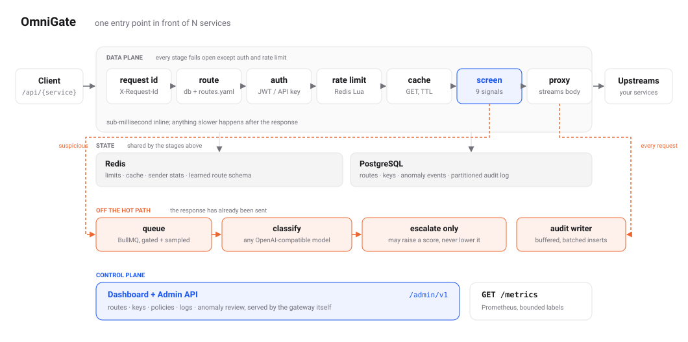

<p align="center"></p>

# OmniGate - AI-powered API Gateway

> A self-hosted API gateway: one entry point in front of your services, with auth, rate limiting,
> caching, learned anomaly detection and a dashboard, in a single container.

**Stack:** NestJS 12 (Express) · Redis 7 · PostgreSQL 16 + Prisma 7 · BullMQ · React 19 + Vite ·
TypeScript 6 · Docker

Detection is measured against an independent benchmark rather than a dataset this project wrote:
**recall 0.494 at precision 1.000 on CSIC 2010**, zero false positives across 36,000 held-out benign
requests. One command gets you the whole thing, dashboard included, on port 8080.

## Architecture

<picture>
  <source media="(prefers-color-scheme: dark)" srcset="docs/assets/architecture-dark.svg">
  
</picture>

`X-Request-Id` → route resolve → auth (JWT | API key) → rate limit (Redis Lua sliding window) →
cache (GET) → anomaly screen → proxy. Everything slower than a millisecond happens after the
response has been sent: classification, enforcement bookkeeping and the buffered audit write.

Auth is the only stage that fails closed. Everything else degrades rather than refuses: Redis down
means no limits and no cache, with `X-RateLimit-Degraded: true` on the response (`RL_FAIL_OPEN=false`
answers 503 instead), and a model that times out or errors allows the request.

Want it in front of your own services? Start with [`docs/15-ADOPTING.md`](docs/15-ADOPTING.md).
The design is in [`docs/02-ARCHITECTURE.md`](docs/02-ARCHITECTURE.md); the rest of `docs/` is the
plan the project was built from and reads as one.

## Production hardening

The image refuses to boot in production on the four placeholder secrets `.env.example` ships with
(`JWT_SECRET`, `API_KEY_PEPPER`, `ADMIN_PASSWORD`, `ADMIN_JWT_SECRET`) and on `EXPOSE_ANOMALY_SCORE=true`.
A deploy that silently keeps the demo credentials is worse than one that fails loudly, because nobody
finds out.

Security headers cover the dashboard and the control plane and are deliberately **not** applied to
`/api`. Those responses belong to the upstream, and a gateway that rewrites an upstream's CSP or
frame policy silently breaks applications it is meant to be transparent to. The dashboard's one
inline script, the theme guard that runs before first paint, is hashed from the built file at boot
rather than allowed with `unsafe-inline` or pinned to a constant that would drift the day someone
edits it.

`GET /metrics` serves Prometheus text: request counts and latency histograms by route, rate-limit
refusals, cache outcomes and anomaly blocks. Labels are bounded values only, never raw paths. It
needs `METRICS_TOKEN`; without one it serves in development and 404s in production, because an open
metrics endpoint on a public URL discloses traffic shape and how close the anomaly stage is to
firing.

`sh tools/smoke-prod.sh $KEY` checks all of this against the running image, including that a proxied
response comes back untouched.

## Project structure

```
apps/gateway        NestJS gateway + worker (data plane, admin API)
apps/dashboard      React admin UI
apps/mock-upstream  Tiny Express service the demo and tests proxy to
load/               k6 scenarios
docs/eval/          200-row labelled anomaly evaluation set (generated)
api-collection/     Bruno collection for the gateway and admin API
packages/shared     DTO / contract types shared by both apps
docs/               PRD, architecture + ADRs, specs, delivery plan, journal
```

## Quick start

The whole product against a bundled mock service, dashboard included, on one port:

```bash
cp .env.example .env    # replace JWT_SECRET, API_KEY_PEPPER, ADMIN_PASSWORD, ADMIN_JWT_SECRET (openssl rand -hex 32)
docker compose -f compose.prod.yml -f compose.demo.yml up --build -d
docker compose -f compose.prod.yml -f compose.demo.yml exec gateway node dist/prisma/seed.js --demo
open http://localhost:8080        # sign in with ADMIN_EMAIL / ADMIN_PASSWORD
```

`compose.demo.yml` is an overlay: it adds the mock upstream, swaps in `routes.demo.yaml` and turns
enforcement on so you can watch a 403 happen. `--demo` on the seed adds two demo routes and a demo API
key. Leave both off and you have a production template with an empty route table, which is the point.

`sh tools/smoke-prod.sh $KEY` checks the running stack end to end: proxying, auth, the anonymous cap
tripping, the cache, the admin API, the dashboard and the security headers. 27 checks.

## Putting it in front of your own service

```bash
cp .env.example .env                                   # the same four secrets
docker compose -f compose.prod.yml up -d               # no mock, empty routes, observe-only anomaly mode
docker compose -f compose.prod.yml exec gateway node dist/prisma/seed.js    # admin + policies, nothing else
open http://localhost:8080                             # Routes -> Add route -> point it at your service
```

A service on the same host is `http://host.docker.internal:4000`; one in your compose stack is its
service name. Clients then call `/api/{service}/...` with an `X-API-Key` minted on the API keys page,
or a JWT from your identity provider. The recipes for a VPS behind nginx, an existing compose stack,
flag-only anomaly mode, external JWKS and a PaaS with managed stores are in
[`docs/15-ADOPTING.md`](docs/15-ADOPTING.md).

For development, `compose.yml` runs the gateway with a bind mount and `pnpm dev:dashboard` serves the
UI on :5173 with hot reload, proxying the control plane to :8080.

## Trying the gateway from the command line

```bash
docker compose up --build -d                 # dev stack: gateway :8080, mock upstream :3001, redis, postgres
docker compose exec gateway pnpm seed -- --demo   # admin, policies, demo routes; prints a demo API key ONCE
export KEY=gw_live_...                       # paste the key from the seed output

curl -i localhost:8080/api/mock/items                      # open route: proxied, X-Request-Id on the response
curl -i localhost:8080/api/orders/items                    # protected route without credentials -> 401 problem+json
curl -i -H "X-API-Key: $KEY" localhost:8080/api/orders/items    # API key -> 200, upstream sees X-Gateway-Principal
curl -i localhost:8080/api/nope                            # unknown service -> 404 problem+json
curl -s localhost:8080/readyz                              # {"status":"ok","redis":"ok","postgres":"ok","routes":2}
```

JWT flow (HS256 with `JWT_SECRET` from `.env`):

```bash
TOKEN=$(docker compose exec gateway pnpm --silent mint-jwt -- --sub alice --scope "orders:read")
curl -i -H "Authorization: Bearer $TOKEN" localhost:8080/api/orders/items     # 200, principal user:alice
TOKEN=$(docker compose exec gateway pnpm --silent mint-jwt -- --sub bob --scope "other")
curl -i -H "Authorization: Bearer $TOKEN" localhost:8080/api/orders/items     # 403 insufficient_scope
```

Rate limiting is visible on every response:

```bash
for i in $(seq 1 31); do curl -s -o /dev/null -w "%{http_code} " localhost:8080/api/mock/items; done; echo   # 30 x 200 then 429: the route allows 100/min, but anonymous callers are also capped per IP by RL_ANON_MAX=30
curl -si localhost:8080/api/mock/items | grep -iE '^HTTP|x-ratelimit|retry-after'
```

The response cache is visible on GET/HEAD responses of routes with a `cache_ttl_seconds` (`X-Cache: HIT|MISS|BYPASS`, `Age`):

```bash
TOKEN=$(docker compose exec gateway pnpm --silent mint-jwt -- --sub demo --scope catalog:read)
curl -si -H "Authorization: Bearer $TOKEN" 'localhost:8080/api/catalog/items?page=1' | grep -iE 'x-cache|^age'   # MISS
curl -si -H "Authorization: Bearer $TOKEN" 'localhost:8080/api/catalog/items?page=1' | grep -iE 'x-cache|^age'   # HIT, Age: n
curl -si -H "Authorization: Bearer $TOKEN" -H 'Cache-Control: no-cache' 'localhost:8080/api/catalog/items?page=1' | grep -i x-cache   # BYPASS (refreshes)
ADMIN=$(curl -s -X POST -H 'content-type: application/json' \
  -d '{"email":"admin@example.com","password":"admin"}' localhost:8080/admin/v1/auth/login | jq -r .accessToken)
curl -s -X POST -H "Authorization: Bearer $ADMIN" localhost:8080/admin/v1/routes/catalog/cache/purge        # {"routeId":"catalog","deletedKeys":n}
```

Every request is scored inline by nine signals (sub-millisecond) and suspicious ones are queued for the LLM stage. In development the score is exposed as a header:

```bash
curl -si "localhost:8080/api/mock/items?id=1'%20OR%201=1--" | grep -i x-anomaly    # X-Anomaly-Score: 0.901, injection_patterns=1.00, queued: gate
curl -si "localhost:8080/api/mock/items?page=2" | grep -i x-anomaly              # X-Anomaly-Score: 0.01x
docker compose exec redis redis-cli --scan --pattern 'bull:anomaly:*'            # the queued jobs
```

Suspicious requests are then classified off the hot path by a pluggable model backend. A route can opt
into synchronous screening, where the verdict is awaited briefly and a high score is refused:

```bash
curl -si -H "X-API-Key: $KEY" "localhost:8080/api/orders/items?id=1'%20OR%201=1--"   # 403 problem+json
```

### Choosing a model backend

`LLM_PROVIDER` selects the adapter. The default, `fake`, is a deterministic stub that needs no account,
no network and no cost.

| `LLM_PROVIDER` | Backend | Notes |
|---|---|---|
| `fake` | none | Deterministic rule stub for tests, CI and offline development |
| `local` | Any OpenAI-compatible server you run | Defaults to Ollama on `http://localhost:11434/v1`; nothing leaves your machine |
| `openai` | OpenAI, or any compatible endpoint | Set `LLM_BASE_URL` for Groq, Together, Mistral, DeepSeek or vLLM |
| `anthropic` | Anthropic Messages API | Forced tool call for structured output |

Only the redacted feature envelope is ever sent: masked query and body samples, heuristic signals and
short-term sender statistics. Any backend can be scored against the labelled dataset:

```bash
pnpm --filter @omnigate/gateway eval:anomaly -- --provider fake
pnpm --filter @omnigate/gateway eval:anomaly -- --provider local --model qwen2.5:7b
```

Detection is measured against the HTTP DATASET CSIC 2010: real requests against a real application,
with the parameter schema learned from a training corpus and every scored request held out from it.

| Detector | Recall | False positives | Precision |
|---|---|---|---|
| Eight pattern and behavioural signals | 0.210 | 0 / 36,000 | 1.000 |
| **+ learned parameter names** (default) | **0.494** | **0 / 36,000** | **1.000** |
| + learned value shapes (opt in) | 0.772 | 28 / 36,000 | 0.999 |

The strongest signal in the gateway is the cheapest: knowing which parameter names each route
legitimately accepts, learned from traffic. On its own it detects more than the eight original pattern and behavioural
signals combined. `idA=1` where the route only ever accepts `id` is invisible to any pattern and
obvious to a schema.

Learning what those parameters normally contain adds another 28 points of recall and is the first
signal here that costs anything: at one attack per thousand requests it trades precision 0.856 for
0.498. That is a decision rather than an upgrade, so it is off unless `SCHEMA_VALUE_SHAPES` is set,
with the numbers written down rather than a default chosen on your behalf.

Learning is the part that needs care, and most of the code is safeguards: only 2xx responses that the
inline pass found unremarkable widen a schema, a new parameter needs several distinct callers before
it counts, unlearned routes stay silent, and routes with open-ended parameters disable the signal
rather than alerting forever.

The same heuristics score 0.900 on this project's own generated dataset. That gap is the most useful
thing the evaluation produced: the synthetic set was scoring the detector against attacks it was
built to catch.

`qwen2.5:7b` recovers four further attacks out of 1,254. The model is a rounding error today and the
reason is structural, not quality: the gate only forwards what the inline pass already suspects. The
second stage is escalate-only, so a weak model is a no-op rather than a regression.

Full write-ups, including the patterns that were measured and rejected and the fix that made things
worse before it made them better: [`anomaly-eval-csic.md`](docs/results/anomaly-eval-csic.md) and
[`anomaly-eval.md`](docs/results/anomaly-eval.md).

Every proxied request lands in a partitioned audit log, and the control plane exposes it:

```bash
TOKEN=$(curl -s -X POST -H 'content-type: application/json' \
  -d '{"email":"admin@example.com","password":"admin"}' localhost:8080/admin/v1/auth/login | jq -r .accessToken)

curl -s -H "Authorization: Bearer $TOKEN" localhost:8080/admin/v1/metrics/overview | jq
curl -s -H "Authorization: Bearer $TOKEN" 'localhost:8080/admin/v1/metrics/breakdown?by=route' | jq
curl -s -H "Authorization: Bearer $TOKEN" 'localhost:8080/admin/v1/logs?limit=20' | jq
curl -s -H "Authorization: Bearer $TOKEN" 'localhost:8080/admin/v1/anomalies?minScore=0.7' | jq
```

Keys, routes and rate-limit policies are managed the same way, and a route created through the API
serves traffic immediately. A Bruno collection covering every endpoint is in
[`api-collection/`](api-collection); metrics query timings over a million rows are in
[`docs/results/metrics-performance.md`](docs/results/metrics-performance.md).

### Dashboard

```bash
pnpm --filter @omnigate/dashboard dev     # http://localhost:5173, proxies /admin and /api to the gateway
```

Sign in with `ADMIN_EMAIL` and `ADMIN_PASSWORD`. The design system, its tokens and the reasoning
behind the chart palette are documented in [`docs/13-DESIGN-SYSTEM.md`](docs/13-DESIGN-SYSTEM.md).

Load and chaos scenarios (k6 via Docker, results committed under `docs/results/`):

```bash
export JWT_SECRET=$(grep ^JWT_SECRET= .env | cut -d= -f2-)
docker run --rm -i --add-host=host.docker.internal:host-gateway -v "$PWD/load:/scripts:ro" -v "$PWD/docs/results:/results" \
  -e BASE_URL=http://host.docker.internal:8080 -e JWT_SECRET -e SUMMARY_PATH=/results/ratelimit-k6.txt \
  grafana/k6 run /scripts/ratelimit.js                       # 500 rps x 60 s: 0 x 5xx, 429s within ±2 %, p95 < 25 ms
docker run --rm -i --add-host=host.docker.internal:host-gateway -v "$PWD/load:/scripts:ro" -v "$PWD/docs/results:/results" \
  -e BASE_URL=http://host.docker.internal:8080 -e JWT_SECRET -e SUMMARY_PATH=/results/cache-k6.txt \
  grafana/k6 run /scripts/cache.js                           # 300 rps x 90 s read-heavy: hit ratio >= 60 %, p95 HIT < 5 ms
```

If 6379 or 5432 are already used on your machine, set `REDIS_HOST_PORT` / `POSTGRES_HOST_PORT` in `.env`.
After changing dependencies run `docker compose build && docker compose up -V`.

## Development

Requires Node 22 (`.nvmrc`), pnpm 10, and Docker.

```bash
cp .env.example .env
pnpm install
pnpm build            # builds shared first, then the apps
pnpm typecheck
pnpm lint
pnpm test                                  # unit tests (no Docker needed)
pnpm test:e2e                              # proxy behaviour against an in-process upstream, no data stores
pnpm test:integration                      # auth + readiness against real Redis/Postgres via Testcontainers (Docker)
docker compose up -d postgres redis        # data stores only, for running the gateway on the host
pnpm --filter @omnigate/gateway prisma:migrate:dev   # create/apply migrations while iterating on the schema
pnpm --filter @omnigate/mock-upstream start:dev   # http://localhost:3001
pnpm dev:gateway                           # http://localhost:8080 (reads .env from the repo root)
pnpm dev:dashboard                         # http://localhost:5173
```

Route table: `apps/gateway/routes.yaml` (schema in [`docs/03-API-SPEC.md`](docs/03-API-SPEC.md)). Every variable the gateway reads is validated at boot; a missing or malformed one prints a readable list and exits. The Prisma client is generated into `apps/gateway/src/generated` (git-ignored) by `pnpm gen`, which every root script runs first.

The day-by-day plan lives in [`docs/08-DELIVERY-PLAN.md`](docs/08-DELIVERY-PLAN.md); the daily journal in [`docs/journal.md`](docs/journal.md).

## License

MIT
